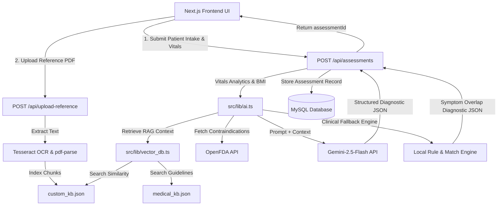

# Dooper Health - AI Clinical Symptom Intelligence Engine (Phase 2)

Dooper Health is an intelligent clinical decision-support portal that enhances standard AI assessments by integrating a structured medical knowledge base, an offline TF-IDF vector database similarity RAG pipeline, and dynamic vital intake analytics.

---

## 🏛️ System Architecture



---

## 💾 Database Design

The application uses **Prisma ORM** with a **MySQL** database. Below is the relational schema of the models:

### 1. User Model
Stores user credentials and profile details.
- `id` (Int, PK, Auto-increment): Unique identifier.
- `email` (String, Unique): User's login email.
- `fullName` (String): User's full name.
- `password` (String): Bcyrpt hashed password.
- `createdAt` (DateTime): Registration timestamp.

### 2. Assessment Model
Stores all historical consultations, clinical findings, and vitals.
- `id` (String, PK, UUID): Unique identifier.
- `userId` (Int, FK): References `User.id` (onDelete: Cascade).
- `age` (Int): Patient age.
- `gender` (String): Patient gender.
- `duration` (String): Duration of symptoms.
- `weight` (Float, Optional): Patient weight in kg.
- `height` (Float, Optional): Patient height in cm.
- `painLevel` (Int, Optional): Pain scale (1-10).
- `pregnancyStatus` (String, Optional): Pregnancy response.
- `existingConditions` (String, Optional): Past chronic conditions.
- `currentMedications` (String, Optional): Medication list.
- `allergies` (String, Optional): Known allergies.
- `primarySymptoms` (String, JSON Array): Selected primary symptoms.
- `secondarySymptoms` (String, JSON Array): Selected secondary symptoms.
- `possibleCondition` (String): Primary differential diagnosis.
- `explanation` (String): Description of the primary condition.
- `severity` (String): Evaluated clinical severity ("Mild" | "Moderate" | "Severe").
- `specialty` (String): Recommended clinical department.
- `healthAdvice` (String): Home care and safety advice.
- `language` (String): Language chosen for assessment.
- `chatHistory` (String, JSON Array): Message history for follow-up chat.
- `analysisResult` (String, JSON): Full structured clinical analysis response containing differential diagnoses, confidence scores, supporting symptoms, and city clinic recommendations.
- `createdAt` (DateTime): Assessment timestamp.

---

## 🧠 AI Workflow & RAG Pipeline

```
Patient Intake Form
       │
       ▼
Calculate Vitals Metrics (BMI, High Pain, Pregnancy Alerts)
       │
       ▼
Vector Database (TF-IDF Cosine Similarity) Retrieval
   ├── Searches standard medical guidelines (medical_kb.json)
   └── Searches user-uploaded PDF knowledge files (custom_kb.json)
       │
       ▼
OpenFDA Database Query
   └── Retrieves warning labels & contraindications for medications
       │
       ▼
AI Analysis (Gemini-2.5-Flash with JSON Schema)
   ├── RAG Context + FDA Contraindications + Intake Vitals
   └── Outputs Possible Conditions, Supporting Symptoms, Severity,
       Specialty, Home Care Advice, City Doctors, Suggested Questions
       │
       ▼
Double-Lock Safety Override Layer (WHO Red Flag Detection)
       │
       ▼
Structured Assessment Page & Interactive Chat Memory
```

---

## 📚 Structured Medical Knowledge Base

We ship with a structured clinical guidelines knowledge base:
- `medical_kb.json`: Standard clinical guidelines containing:
  - Conditions: Viral Fever, Common Cold, Migraine, Pneumonia, Coronary Artery Disease, Contact Dermatitis, Gastroenteritis.
  - Core Metadata: Clinical explanations, recommended medical specialty, self-care guidelines, and evidence-backed citations from trusted sources (WHO, CDC, NHS, MedlinePlus).
- `custom_kb.json` (Dynamic RAG): Automatically stores user-uploaded medical guideline books, textbook chapters, or clinical articles parsed via server-side OCR.

---

## 🔌 APIs and Libraries Used

- **Google GenAI SDK**: Integrates the `gemini-2.5-flash` model for structured JSON clinical reasoning.
- **OpenFDA API**: Rest endpoint used to retrieve warnings and contraindications for patient medications dynamically.
- **Tesseract.js**: Server-side OCR engine used to extract clinical terms from uploaded prescriptions and medical reports.
- **pdf-parse**: PDF parsing engine used to read uploaded reference manuals for Custom RAG.
- **Web Speech API**: Browser speech recognition dictating voice symptoms.

---

## 🛠️ Setup Instructions

### Prerequisites
- Node.js (v18+)
- MySQL Server

### Installation Steps

1. **Clone the repository and install dependencies:**
   ```bash
   npm install
   ```

2. **Configure Environment Variables:**
   Create a `.env` file in the root directory:
   ```env
   DATABASE_URL="mysql://<user>:<password>@127.0.0.1:3306/symptom_checker"
   JWT_SECRET="your_jwt_secret_key"
   GEMINI_API_KEY="your_actual_gemini_api_key"
   ```

3. **Initialize Prisma Client & Database Schemas:**
   ```bash
   npx prisma db push
   npx prisma generate
   ```

4. **Run Developer Server:**
   ```bash
   npm run dev
   ```
   Open [http://localhost:3000](http://localhost:3000) to view the portal.
